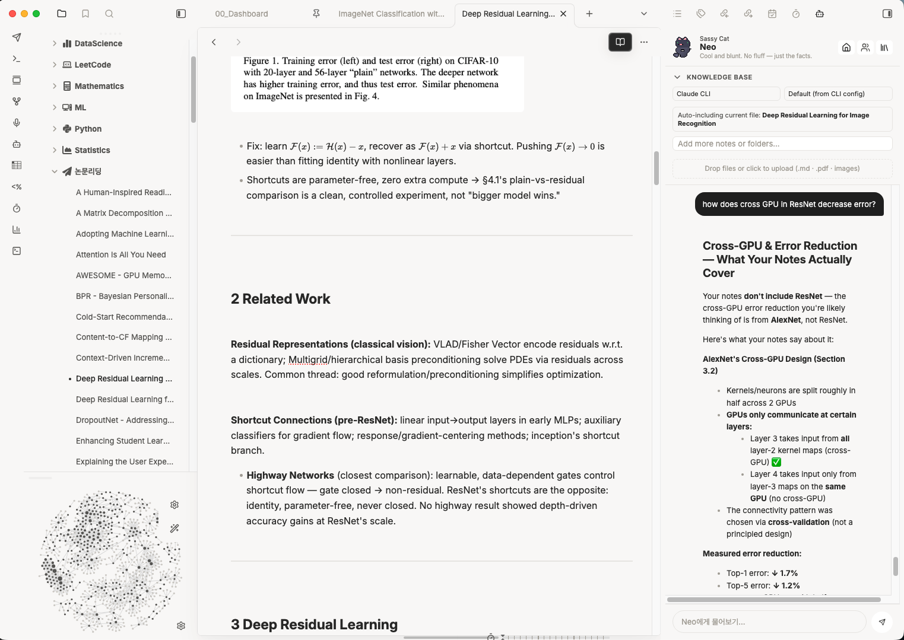
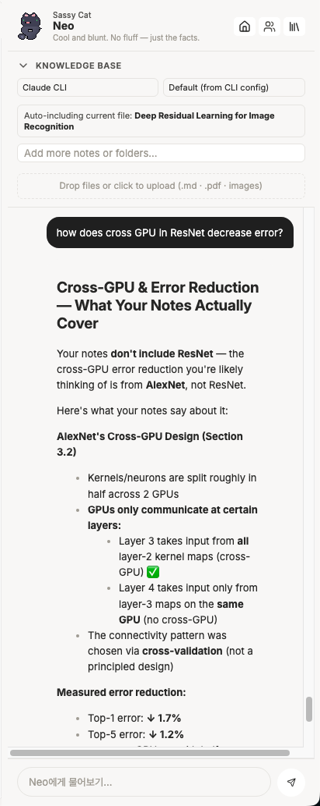
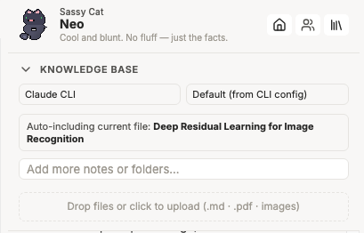
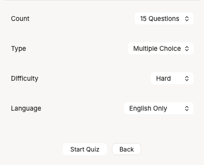
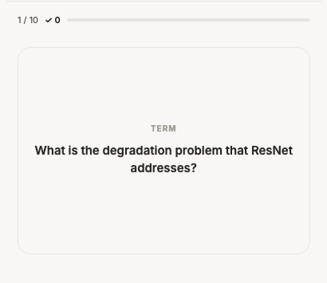
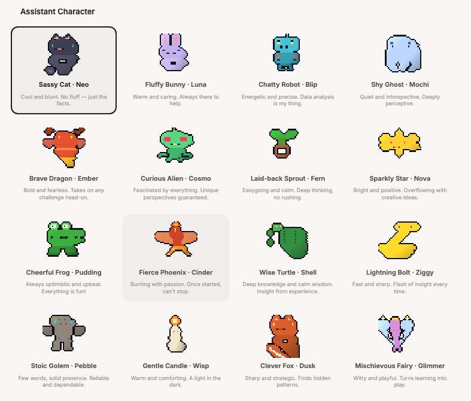
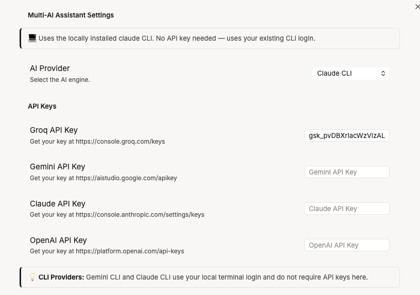

# Multi-AI Assistant

An Obsidian sidebar that turns your vault into a study partner. Point it at notes, folders, PDFs, or images, then chat about them, generate quizzes, or drill flashcards — using Groq, Gemini, OpenAI, Claude, or a locally installed Gemini/Claude CLI.



---

## Features

**Bring your own context.** Add individual notes, entire folders, PDFs, and images to a knowledge base panel. The note you currently have open is included automatically, and a running token estimate tells you how much context you're sending.

**Four modes.**

| Mode | What it does |
| --- | --- |
| 💬 Chat | Streamed answers grounded in your sources, rendered as real Markdown. Copy, save as a new note, or append to an existing one. |
| ❓ Quiz | Multiple-choice, short-answer, or essay questions. Free-text answers are graded by the model with written feedback; results can be saved as a note. |
| 🃏 Flash cards | Generated term/definition pairs with a self-scored review session. |
| 📓 NotebookLM | Opens Google NotebookLM in the sidebar (desktop) or in your browser (mobile). |

**Six providers.** Groq, Gemini, OpenAI, and Claude over their HTTP APIs — plus the `gemini` and `claude` CLIs on desktop, which reuse the login you already have in your terminal and need no API key.

**Ask about a selection.** Highlight text anywhere in Obsidian and a small search button appears; click it to send that text straight to the assistant.

**16 characters.** Each has its own sprite, personality blurb, and greeting. Purely cosmetic, entirely the point.

---

## Screenshots

| | |
| --- | --- |
|  |  |
|  |  |
|  |  |

---

## Installation

### From a release

1. Download `main.js`, `manifest.json`, `styles.css`, `pdf.worker.min.js`, and all `sprite-*.png` files from the [latest release](https://github.com/lucytheboss/multi-ai-assistant/releases).
2. Put them in `<your vault>/.obsidian/plugins/multi-ai-assistant/`.
3. Reload Obsidian and enable **Multi-AI Assistant** under Settings → Community plugins.

> [!IMPORTANT]
> The character sprites and the PDF.js worker are loaded from the plugin folder at runtime, so they have to be shipped alongside `main.js`. See [Known limitations](#known-limitations) — this needs solving before a community-store submission.

### From source

```bash
git clone https://github.com/lucytheboss/multi-ai-assistant
cd multi-ai-assistant
npm install
npm run build     # or: npm run dev  (watch mode)
```

Then copy the plugin folder into `<your vault>/.obsidian/plugins/`, or clone directly into that directory.

---

## Setup

Open **Settings → Multi-AI Assistant**, pick a provider, and paste a key.

| Provider | Cost | Get a key |
| --- | --- | --- |
| **Groq** | Free, no card required — start here | <https://console.groq.com/keys> |
| **Gemini** | Free in some regions, may require billing | <https://aistudio.google.com/apikey> |
| **Claude** | Paid API credit | <https://console.anthropic.com/settings/keys> |
| **OpenAI** | Paid account | <https://platform.openai.com/api-keys> |
| **Gemini CLI** | Uses your existing CLI login — no key | Install the `gemini` CLI |
| **Claude CLI** | Uses your existing CLI login — no key | Install the `claude` CLI |

The two CLI providers are **desktop only** and are hidden from the provider list on mobile. If your CLI isn't on the `PATH` that Obsidian sees, set an absolute path under **Local CLI providers** in settings (e.g. `/opt/homebrew/bin/gemini`).

You can also switch provider and model on the fly from the two dropdowns at the top of the knowledge base panel — no need to open settings.

---

## Usage

**Open it** with the robot icon in the ribbon, or the *Multi-AI Assistant: Open sidebar* command.

**Add sources.** Type in the knowledge base search box to find notes and folders; adding a folder pulls in every readable file under it. Drop files onto the upload area (or click it) for `.md`, `.txt`, `.pdf`, `.png`, `.jpg`, `.jpeg`, `.webp`, `.gif`. Images are sent to the model as images, so you can ask about diagrams and screenshots. Remove a source with the `×` on its chip.

**Chat.** Enter sends, Shift+Enter makes a newline. Answers stream in as plain text and are re-rendered as Markdown when complete.

**Quiz and flashcards** each start on a short setup screen (count, type, difficulty, language) so you can tune a session without leaving the sidebar. Quiz results can be saved to a `Quiz-Results-<timestamp>.md` note.

**Quiz and flashcard content can be generated in English, Korean, or both** — useful if you're studying in a second language.

---

## Privacy and security

This plugin does more than talk to an HTTP API, and you should know exactly what before you trust it with a vault.

**Your notes leave your machine.** Whatever you add to the knowledge base — plus the note you currently have open — is sent to whichever provider you selected, as part of the prompt. Nothing is sent until you ask a question, generate a quiz, or generate flashcards. There is no telemetry and no server belonging to this plugin.

**API keys** are stored in plain text in `data.json` inside the plugin folder, like every other Obsidian plugin. Anything with read access to your vault can read them.

**The CLI providers run a program on your computer.** Selecting *Gemini CLI* or *Claude CLI* spawns that binary as a child process with your vault as its working directory and pipes the prompt to it over stdin. The Gemini CLI is invoked with `--approval-mode yolo`, which lets it use its own tools (including web search and file access) without prompting you — that is what makes live web search work, and it is also a meaningful amount of trust. If you don't want that, use the plain Gemini API provider instead.

**The NotebookLM tab embeds `notebooklm.google.com` in an iframe** on desktop. That is Google's page running inside Obsidian, subject to Google's terms and cookies.

**The bundle reads the filesystem** via the PDF.js and OpenAI libraries, which include Node `fs` code paths for non-browser environments. The plugin's own code only touches the vault through Obsidian's APIs, plus the plugin folder itself for sprites and the PDF worker.

---

## Known limitations

- **Asset shipping.** Obsidian's community-plugin installer only fetches `main.js`, `manifest.json`, and `styles.css`. The character sprites and `pdf.worker.min.js` live as separate files, so they need to be inlined into the bundle (sprites as data URIs, worker via a blob URL) before this can be listed in the community store.
- **Streaming uses `fetch`, not `requestUrl`.** Obsidian's `requestUrl` buffers whole responses, so the Claude streaming path uses `fetch` with the direct-browser-access header. Non-streaming requests go through `requestUrl`.
- **Settings search.** The settings tab uses the classic `display()` API, so its options don't appear in Obsidian 1.13+ settings search. Migrating to `getSettingDefinitions()` is a follow-up.
- **Model lists are hardcoded** in `src/SettingsTab.ts` and will drift as providers ship new models.

---

## Development

```
main.ts                 Plugin entry: view registration, ribbon, command, selection button
src/SidebarView.ts      The whole sidebar UI — header, knowledge base, and all four modes
src/AIService.ts        Provider dispatch: HTTP APIs, streaming, and the local CLI runner
src/FileProcessor.ts    Vault + upload ingestion, PDF text extraction, image base64
src/SettingsTab.ts      Settings pane, provider/model tables, defaults
src/characters.ts       The 16 character definitions
styles.css              All styling; the UI sets CSS classes and custom properties, never inline styles
esbuild.config.mjs      Bundling, plus two source patches (see below)
```

Two things in the build are worth knowing about:

- `dynamic-import` is disabled in esbuild's `supported` map, which lowers `await import(...)` to a lazy `require()`. Obsidian evaluates `main.js` as CommonJS, where a native dynamic import isn't reliable.
- A small esbuild plugin strips PDF.js's `loadScript()` helper, which injects a `<script>` tag to fetch its worker. This plugin always points `GlobalWorkerOptions.workerSrc` at the worker file in the plugin folder, so that path is dead code — removing it keeps the shipped bundle free of dynamic script injection. If you bump `pdfjs-dist` and the pattern moves, the build fails loudly rather than silently skipping the patch.

### Releasing

Tag and name the GitHub release **exactly** the version in `manifest.json` (e.g. `1.0.0`, no `v` prefix) — Obsidian's release checker matches on this. Attach `main.js`, `manifest.json`, `styles.css`, `pdf.worker.min.js`, and the `sprite-*.png` files.

---

## Credits

Character sprites generated with `make_sprites.py`. PDF text extraction by [PDF.js](https://mozilla.github.io/pdf.js/).

## License

MIT
